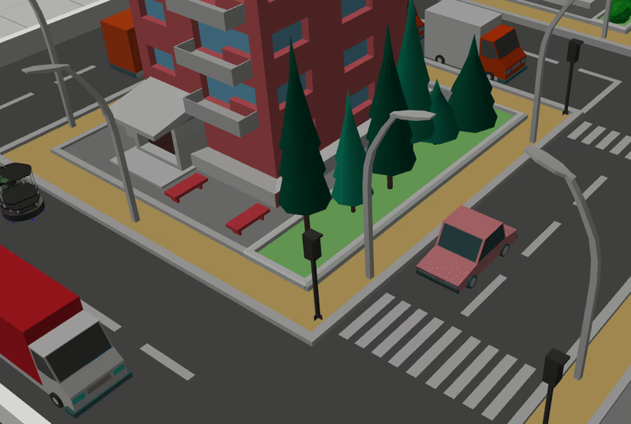
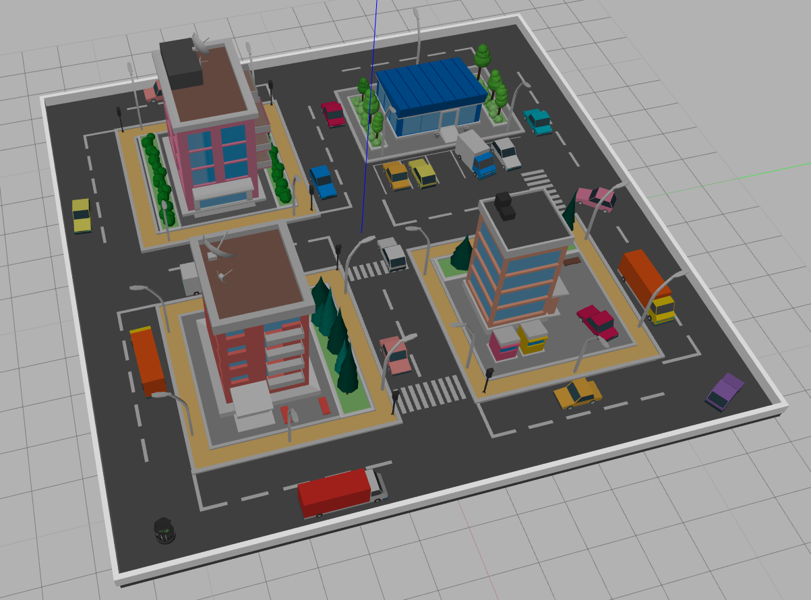

Репозиторий содержит исходные файлы для сборки docker контейнеров и всего необходимого ПО для работы с turtlebot 2 на котором дополнительно установлена rgbd-камера Astra Orbbec и лидар RPLidar A2, а так же симуляции такого робота.

### Работа с Turtlebot 2

#### Установка требуемого ПО

1. Если вы получили робота во время участия в хакатоне, то смело переходите к следующему разделу, все требуемое ПО уже должно быть установлено на роботе.

2. Склонируйте репозиторий и перейдите в корневую директорию репозитория.

3. Установите docker, задайте необходимое для работы окружение и udev-правила для используемого на turtlebot аппаратного обеспечения вызвав следующую команду:

        bash scripts/kobuki_setup.bash

    После этой операции следует перезайти в систему для корректной работы docker.

#### Использование docker-контейнера и организация процесса разработки

1. Для работы с докер-контейнером доступны следующие команды.

        kobuki_docker_build - сборка контейнера
        kobuki_docker_run - запуск контейнера
        kobuki_docker_into - запуск bash в контейнере

    В случае, если по какой-то причине они не доступны, из любой директории можно исполнить следеющие скрипты:

        ~/kobuki/docker/kobuki/build_docker.sh - сборка контейнера
        ~/kobuki/docker/kobuki/run_docker.sh - запуск контейнера
        ~/kobuki/docker/kobuki/into_docker.sh - запуск bash в контейнере

    Соответственно, соберите и запустите контейнер выполнив последовательно:

        kobuki_docker_build
        kobuki_docker_run

2. Для удобства разработки в корне проекта созданы два [catkin_tools](https://catkin-tools.readthedocs.io/en/latest/quick_start.html) окруженя: /driver_ws и catkin_ws.

    В drivers_ws располагаются драйвера аппаратного обеспечения робота, catkin_ws - пользовательское окружение.  Оба окружения монтируются внутрь контейнера, таким образом разработку можно вести как внутри, так и вне контейнера.

    При первом входе в контейнер требуется собрать драйвера в окружении drivers_ws, для этого:

        cd /drivers_ws
        catkin build

#### Работа с окружением, описание предоставляемого ПО

1. Для запуска драйверов следует использовать соответствующие launch файлы из пакета tb:

        roslaunch tb rplidar.launch -- запуск драйвера лидара
        roslaunch tb base.launch    -- запуск драйвера kobuki
        roslaunch tb astra.launch   -- запуск драйвера rgbd-камеры

    При попытке запуска обозначенных выше команд после первой сборки окружения driver_ws в том же терминале вы можете получить ошибку, так как для текущей bash-сессии переменная окружения PATH еще не содержит соответствующих путей, для того, чтобы исправить это выполните:

        source /driver_ws/devel/setup.bash

    Выполните:

        roslaunch tb base.launch

    Затем запустите новый терминал, откройте еще одну bash-сессию в контейнере и запустите teleop:

        kobuki_docker_into
        roslaunch tb teleop.launch

     В случае, если вы можете управлять роботом, то подготовку к работе с turtlebot можно считать оконченой.

2. В случае проблем с обращением к роботу по hostname для удаленной работы с ROS Master на роботе (например для визуализации данных с робота в r-viz) можно воспользоваться:

        source scripts/ros_remote_env.bash <robot_ip>

### Работа с симулятором (turtletown)

#### Установка требуемого ПО

1. Склонируйте репозиторий и перейдите в корневую директорию репозитория.

3. Установите docker:

        bash scripts/docker_install.bash

    В случае, если на вашем ПК используется видеокарта от nvidia, то обозначенный выше скрипт следует исполнить с параметром -n или --nvidia.

    Для установки в ручную для установки docker воспользуйтесь [оффициальной инструкцией](https://docs.docker.com/install/linux/docker-ce/ubuntu/). В случае, если на вашем ПК используется видеокарта от nvidia, то дополнительно следует установить [nvidia container toolkit](https://github.com/NVIDIA/nvidia-docker).

    После этой операции следует перезайти в систему для корректной работы docker.

#### Использование docker-контейнера и организация процесса разработки

1. Для работы с докер-контейнером доступны следующие команды:

        <path-to-this-rep>/docker/kobuki/build_docker.sh - сборка контейнера
        <path-to-this-rep>/docker/kobuki/run_docker.sh - запуск контейнера
        <path-to-this-rep>/docker/kobuki/into_docker.sh - запуск bash в контейнере

    Соответственно, соберите и запустите контейнер выполнив последовательно:

        build_docker.sh
        run_docker.sh

    В случае, если на вашем ПК используется видеокарта от nvidia, то обозначенные выше скрипты следует исполнить с параметром -n или --nvidia.

2. Для удобства разработки в корне проекта созданы два [catkin_tools](https://catkin-tools.readthedocs.io/en/latest/quick_start.html) окруженя: simulator_ws и catkin_ws.

    В simulator_ws располагаются модели, файлы описания и плагины, требующиеся для симуляции turtlebot, catkin_ws - пользовательское окружение.  Оба окружения монтируются внутрь контейнера, таким образом разработку можно вести как внутри, так и вне контейнера.

    При первом входе в контейнер требуется собрать драйвера в окружении simulator_ws, для этого:

        cd /simulator_ws
        catkin build

    При попытке запуска обозначенных выше команд после первой сборки окружения simulator_ws в том же терминале вы можете получить ошибку, так как для текущей bash-сессии переменная окружения PATH еще не содержит соответствующих путей, для того, чтобы исправить это выполните:

        source /simulator_ws/devel/setup.bash

#### Работа с окружением, описание предоставляемого ПО

1. Для запуска симуляции воспользуйтесь launch-файлом из пакета tb_gazebo:

        roslaunch tb_gazebo turtletown.launch

    После этого в окне gazebo вы должны увидеть примерно следующую картинку:

    

    Запустите новый терминал, откройте еще одну bash-сессию в контейнере и запустите teleop:

        <path-to-this-rep>/docker/kobuki/into_docker.sh
        roslaunch tb_gazebo teleop.launch

     В случае, если вы можете управлять роботом, то подготовку к работе с симулятором можно считать оконченой.

    При попытке запуска обозначенных выше lauch-файлов после первой сборки окружения simulator_ws в том же терминале вы можете получить ошибку, так как для текущей bash-сессии переменная окружения PATH еще не содержит соответствующих путей, для того, чтобы исправить это выполните:

        source /driver_ws/devel/setup.bash

### Информация о роботах

| TurtleBot # | user@host | Password| Status |
|:--|:--:|---:|---:|
| TurtleBot 1 | tb1@tb1 | tb | ready |
| TurtleBot 2 | tb2@tb2 | tb | ready |
| TurtleBot 3 | tb3@tb3 | tb | ready |
| TurtleBot 4 | tb4@tb4 | tb | ready |
| TurtleBot 5 | tb5@tb5 | tb | ready |
| TurtleBot 6 | tb6@tb6 | tb | ready |
| TurtleBot 7 | tb7@tb7 | tb | ready |
| TurtleBot 8 | tb8@tb8 | tb | ready |
| TurtleBot 9 | tb9@tb9 | tb | ready |
| TurtleBot 10 | tb10@tb10 | tb | ready |
| TurtleBot 11 | tb11@tb11 | tb | ready |
| TurtleBot 12 | tb12@tb12 | tb | ready |
| TurtleBot 13 | tb13@tb13 | tb | ready |
